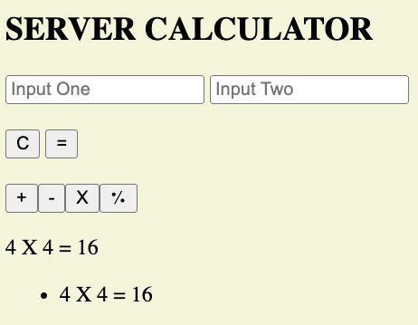
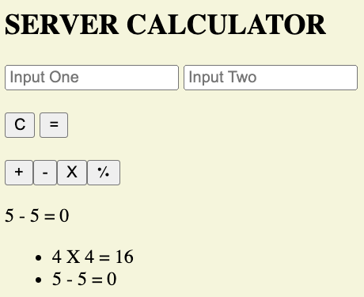

# Server Side Calculator

## Description
We were tasked with making a client side side calculator but all of the math is done on the server and then we do an axios call to append it back onto the DOM. The previous math equations we sent through needed to stay in the history to show previous calculations on the DOM. 

* Showing previous equations even when a new one is put in
